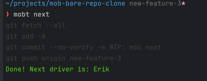
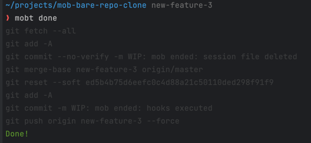
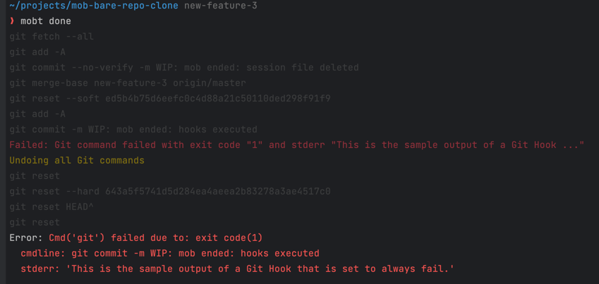

# Mob-Tool: `mobt`

Mob-Tool is a command-line tool to manage mob programming sessions for remote teams. The tool helps the team manage the
session by controlling the timer, switching the driver role among the team members, and simplifying the necessary Git
commands to hand over the work to the next team member.


> Mob programming is a software development approach where a team of developers works together on the same task at the
> same time.

## What changes does the tool make to the repository?

- **No changes are done in `main` branch.** All the changes are done in a new feature branch. You choose the name of the
  branch when you start the mob session.
- **All Git commands executed by the tool are logged in the output.** This way, the team can easily see what changes are
  being done to their repository.
- **All commands are rollback if any error occurs.** The commands to rollback are also logged in the output.

## Installation

```shell
pip install mob-tool
```

## Usage

### Starting a new session

Start a new session with the following command:

```shell
mobt start <branch-name>
```

See below an example of the output of the `start` command:


### Handing over to the next driver

When your time is up, pass the driver role to the next team member with the command:

```shell
mobt next
```

See below an example of the output of the `next` command:


You must call this command even if you didn't make any changes in the code so the mob tool can manage whose turn is
next.

The next drive (in this example, Erik) can start working by running the same `mobt start <branch-name>` command:

### Finishing the session when the feature is done

When your feature is ready, you can end the session with the following command:

```shell
mobt done
```

It will squash all the commits and push all the changes to the remote. All git hooks will be executed for this final
commit. The hooks are always ignored during the `start` and `next` commands.

See below an example of the output of the `done` command:


## FAQ

### What happens if one of the Git commands fails?

All change made to the repository are rollback.

See below an example of the output with a rollback in action.

